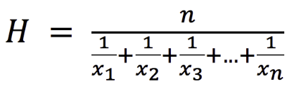

# Theory
## T10. 
### Explain all possible derivation of the arithmetic mean and in general of the other common types of averages.

The Arithmetic Mean:
is the value obtained by dividing the sum of all observations by the number of observations, so is the sum of X1…Xn divided by n.

The geometric mean:
is more complicated and uses a more complex formula. To formula for calculating the geometric mean is to multiply all values within a data set. Then, take the root of the sum equal to the quantity of values within that data set. For example, to calculate the geometric of the values 4 and 9, multiply the two numbers together to get 36. Then, take the square root (since there are two values). 
Pros:
It is less likely to be impacted by extreme outliers, It can't be used if any value within the data set is 0 or negative, Its formula is more complex and not easily used, Its calculation is not transparent and more difficult to audit, It is less prevalent and not used as much as other methods.
Cons: It can't be used if any value within the data set is 0 or negative, Its formula is more complex and not easily used, Its calculation is not transparent and more difficult to audit, It is less prevalent and not used as much as other methods.

The harmonic mean:
is the reciprocal of the arithmetic mean of the reciprocals of a set of observations. The harmonic mean is mostly used in finance for financial multiples such as the P/E ratio. The harmonic mean of a group of positive real numbers X1,…,Xn is defined as follow:

## T11
### Illustrate the difference between "mathematical convergence" and "convergence" in probability
Convergence in mathematics is a property of approaching a limit more and more explicitly as an argument variable of the function increases or decreases or as the number of terms of the series gets increased. For instance, the function y = 1/x converges to zero as it increases the x, but no finite value of x will influence the value of y to effectively become zero, the limiting value of y is zero and this is due to the fact that y can be made as small as wanted by selecting x large enough. The line y = 0, the x-axis, is recognised as an asymptote of the function.

Statistical convergence is a sequence where the majority of elements of the sequence converge. The concept of statistical convergence is directly connected to convergence of such statistical characteristics as the mean and standard deviation. Sequences that come from real life sources don’t allow to test whether they converge or statistically converge in a mathematical way. To avoid these problems there were invented new type of analysis. The idea was to extends the scope and results of the classical mathematical analysis by applying some logic to conventional mathematical objects like functions, sequences or series. These new methods allow to reflect and model vagueness and uncertainty of our knowledge.

A sequence {Xn} of random variables converges in probability towards the random variable X if for all ε > 0 such that lim for n->infinite of PR (|Xn-X|) >  ε) = 0.

If we have Pn(ε) (the probability that Xn is outside the sphere of radius ε with center at X) Then Xn converge in probability to X if for any ε > 0 and δ > 0 there is a number N (that can depend on ε and δ) such that for every n ≥ N, Pn(ε) < δ.

If we want to satisfy the condition is impossible that for all n the rv X and Xn are indipendent, unless X is deterministic like in the weak law of large numbers. Also the case of a deterministic X cannot, every time the deterministic value is a discontinuity point, be handled by convergence in distribution, where discontinuity points have to be explicitly excluded.

## T12
### Illustrate the differences between Descriptive Statistics and Inferential Statistics and the role of probability and probability distributions

Descriptive statistics:
is the term given to the analysis of data that helps describe, show or summarize data in a meaningful way such that, for example, patterns might emerge from the data. Descriptive statistics do not, however, allow us to make conclusions beyond the data we have analysed or reach conclusions regarding any hypotheses we might have made. They are simply a way to describe our data.
Descriptive statistics are very important because if we simply presented our raw data it would be hard to visualize what the data was showing, especially if there was a lot of it. Descriptive statistics therefore enables us to present the data in a more meaningful way, which allows simpler interpretation of the data. For example, if we had the results of 100 pieces of students' coursework, we may be interested in the overall performance of those students. We would also be interested in the distribution or spread of the marks.

Inferential statistics:
allows researchers to make generalizations about a population by using a representative sample. However, since one cannot predict the behavior of a population accurately in almost all cases, the results are said to be based on uncertainty.
Inferential statistics requires logical reasoning to arrive at the results. The procedure of reaching the outcomes is stated as follows:   
A sample is chosen from the population that needs to be studied. The chosen sample must reflect the nature and characteristics of the population.
The tools of inferential statistics are applied to the sample to assess its behavior. These include the regression models and the hypothesis testing models. The former consists of linear regression, nominal regression, logistic regression, etc., while the latter consists of the z-test, t-test, f-test, analysis of variance (ANOVA), etc.
Inferences are drawn from the sample chosen in the first step. The inferences are assumptions or estimations related to the entire population.

# Applications
## A8 
### Given an arbitrary rectangle and a distribution, create the corresponding histogram or column chart, with both vertical and horizontal orientation
The proposed solution is in the ZIP file that can be found at [this GitHub link](https://github.com/pulell-af/StatisticsHomeworks/tree/main/Homework5.1Charp/Histogram).

## A9. 
### Given a rectangle, enable its movement/resize/zoom using a mouse (this will be the resizable where we will draw alll future charts)
The proposed solution is in the ZIP file that can be found at [this GitHub link](https://github.com/pulell-af/StatisticsHomeworks/tree/main/Homework5.2Charp/RectangleResize).
